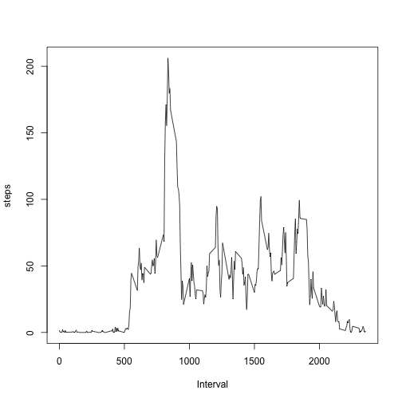

## Loading and preprocessing the data


```r
if (!file.exists("activity.csv")) {
  unzip("activity.zip")  
}
data = read.csv("activity.csv")
complete = data[complete.cases(data),]
```

## What is mean total number of steps taken per day?


```r
# Calculate the total number of steps taken per day
steps_per_day = aggregate(complete$steps, by=list(Date=complete$date), FUN=sum)
head(steps_per_day)
```

```
##         Date     x
## 1 2012-10-02   126
## 2 2012-10-03 11352
## 3 2012-10-04 12116
## 4 2012-10-05 13294
## 5 2012-10-06 15420
## 6 2012-10-07 11015
```

```r
# Make a histogram of the total number of steps taken each day
hist(steps_per_day$x, xlab="Total steps", main="Histogram: Total number of steps per day")
```

 

```r
# Calculate and report the mean and median of the total number of steps taken per day
print(c(mean(steps_per_day$x), median(steps_per_day$x)))
```

```
## [1] 10766.19 10765.00
```


## What is the average daily activity pattern?


```r
# Make a time series plot (i.e. type = "l") of the 5-minute interval (x-axis)
# and the average number of steps taken, averaged across all days (y-axis)
interval_averages = aggregate(complete$steps, by=list(interval=complete$interval), FUN=mean)
head(interval_averages)
```

```
##   interval         x
## 1        0 1.7169811
## 2        5 0.3396226
## 3       10 0.1320755
## 4       15 0.1509434
## 5       20 0.0754717
## 6       25 2.0943396
```

```r
plot(interval_averages$interval, interval_averages$x, type="l", xlab="Interval", ylab="steps")
```

 

```r
# Which 5-minute interval, on average across all the days in the dataset,
# contains the maximum number of steps?
interval_averages[which(interval_averages$x == max(interval_averages$x)),"interval"]
```

```
## [1] 835
```


## Imputing missing values


```r
# Calculate and report the total number of missing values in the dataset (i.e.
# the total number of rows with NAs)
sum(is.na(data$steps))
```

```
## [1] 2304
```

```r
# Devise a strategy for filling in all of the missing values in the dataset.
# The strategy does not need to be sophisticated. For example, you could use
# the mean/median for that day, or the mean for that 5-minute interval, etc.

# Create a new dataset that is equal to the original dataset but with the
# missing data filled in.

# Make a histogram of the total number of steps taken each day and Calculate
# and report the mean and median total number of steps taken per day.

# Do these values differ from the estimates from the first part of the
# assignment?

# What is the impact of imputing missing data on the estimates of the total
# daily number of steps?
```


## Are there differences in activity patterns between weekdays and weekends?
