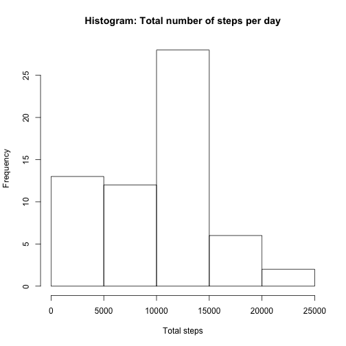
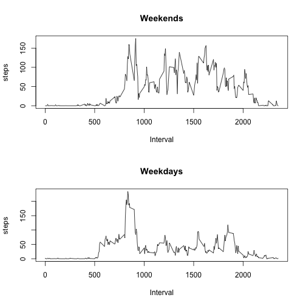

## Loading and preprocessing the data


```r
if (!file.exists("activity.csv")) {
  unzip("activity.zip")  
}
data = read.csv("activity.csv")
complete = data[complete.cases(data),]
```

## What is mean total number of steps taken per day?


```r
# Calculate the total number of steps taken per day
steps_per_day = aggregate(complete$steps, by=list(Date=complete$date), FUN=sum)
head(steps_per_day)
```

```
##         Date     x
## 1 2012-10-02   126
## 2 2012-10-03 11352
## 3 2012-10-04 12116
## 4 2012-10-05 13294
## 5 2012-10-06 15420
## 6 2012-10-07 11015
```

```r
# Make a histogram of the total number of steps taken each day
hist(steps_per_day$x, xlab="Total steps", main="Histogram: Total number of steps per day")
```

 

```r
# Calculate and report the mean and median of the total number of steps taken per day
print(c(mean(steps_per_day$x), median(steps_per_day$x)))
```

```
## [1] 10766.19 10765.00
```


## What is the average daily activity pattern?


```r
# Make a time series plot (i.e. type = "l") of the 5-minute interval (x-axis)
# and the average number of steps taken, averaged across all days (y-axis)
interval_averages = aggregate(complete$steps, by=list(interval=complete$interval), FUN=mean)
head(interval_averages)
```

```
##   interval         x
## 1        0 1.7169811
## 2        5 0.3396226
## 3       10 0.1320755
## 4       15 0.1509434
## 5       20 0.0754717
## 6       25 2.0943396
```

```r
plot(interval_averages$interval, interval_averages$x, type="l", xlab="Interval", ylab="steps")
```

 

```r
# Which 5-minute interval, on average across all the days in the dataset,
# contains the maximum number of steps?
interval_averages[which(interval_averages$x == max(interval_averages$x)),"interval"]
```

```
## [1] 835
```


## Imputing missing values


```r
# Calculate and report the total number of missing values in the dataset (i.e.
# the total number of rows with NAs)
sum(is.na(data$steps))
```

```
## [1] 2304
```

```r
# Devise a strategy for filling in all of the missing values in the dataset.
# The strategy does not need to be sophisticated. For example, you could use
# the mean/median for that day, or the mean for that 5-minute interval, etc.

# Actual strategy used:
# Just use the nr 0

# Create a new dataset that is equal to the original dataset but with the
# missing data filled in.

imputed_data <- data
imputed_data$steps[is.na(imputed_data$steps)] <- 0
head(imputed_data)
```

```
##   steps       date interval
## 1     0 2012-10-01        0
## 2     0 2012-10-01        5
## 3     0 2012-10-01       10
## 4     0 2012-10-01       15
## 5     0 2012-10-01       20
## 6     0 2012-10-01       25
```

```r
# Make a histogram of the total number of steps taken each day

# Calculate the total number of steps taken per day
imputed_steps_per_day = aggregate(imputed_data$steps, by=list(Date=imputed_data$date), FUN=sum)
head(imputed_steps_per_day)
```

```
##         Date     x
## 1 2012-10-01     0
## 2 2012-10-02   126
## 3 2012-10-03 11352
## 4 2012-10-04 12116
## 5 2012-10-05 13294
## 6 2012-10-06 15420
```

```r
# Make a histogram of the total number of steps taken each day
hist(imputed_steps_per_day$x, xlab="Total steps", main="Histogram: Total number of steps per day")
```

 

```r
# Calculate and report the mean and median total number of steps taken per day.
print(c(mean(imputed_steps_per_day$x), median(imputed_steps_per_day$x)))
```

```
## [1]  9354.23 10395.00
```


## Are there differences in activity patterns between weekdays and weekends?


```r
# Create a new factor variable in the dataset with two levels – “weekday” and
# “weekend” indicating whether a given date is a weekday or weekend day.

complete$daytype = as.factor(ifelse(weekdays(as.Date(complete$date)) %in% c("Saturday", "Sunday"), "weekend", "weekday"))

# Make a panel plot containing a time series plot (i.e. type = "l") of the
# 5-minute interval (x-axis) and the average number of steps taken, averaged
# across all weekday days or weekend days (y-axis).

weekends = complete[which(complete$daytype=="weekend"),]
weekdays = complete[complete$daytype=="weekday",]

interval_averages_weekends = aggregate(weekends$steps, by=list(interval=weekends$interval), FUN=mean)
interval_averages_weekdays = aggregate(weekdays$steps, by=list(interval=weekdays$interval), FUN=mean)

par(mfrow=c(2,1))

# First weekends

plot(interval_averages_weekends$interval, interval_averages_weekends$x, type="l", xlab="Interval", ylab="steps", main="Weekends")

# Now weekdays

plot(interval_averages_weekdays$interval, interval_averages_weekdays$x, type="l", xlab="Interval", ylab="steps", main="Weekdays")
```

 
